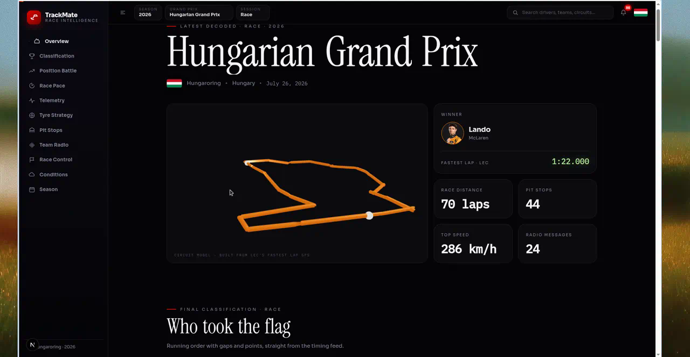
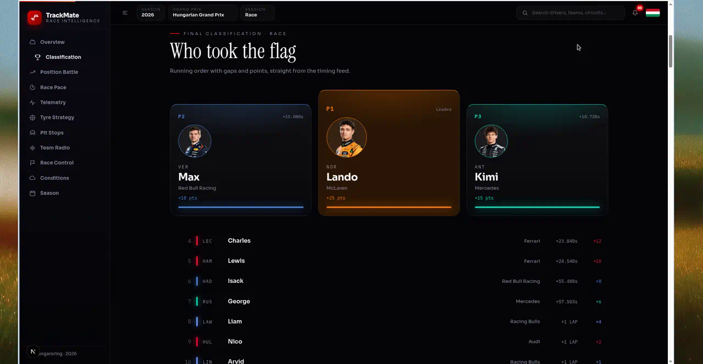
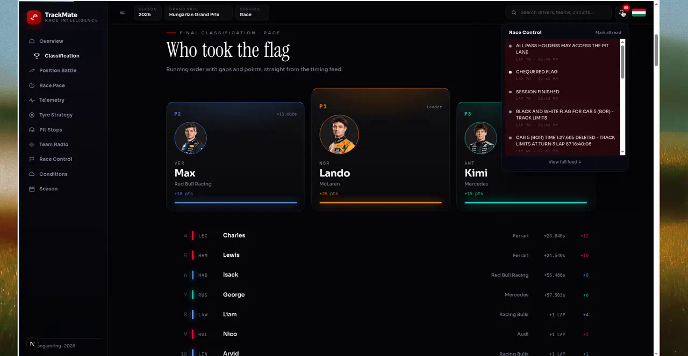
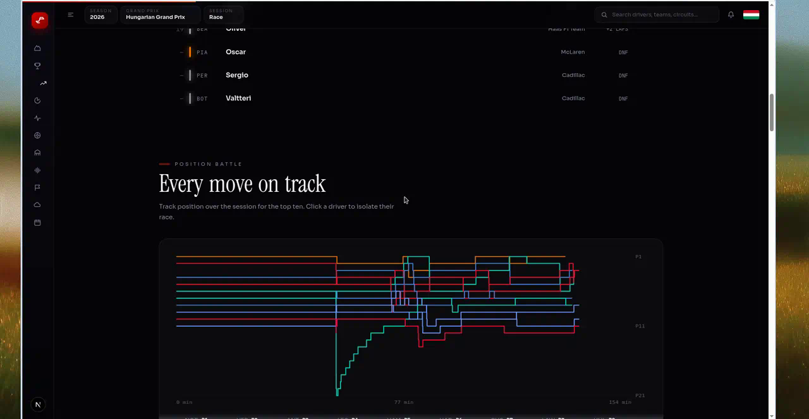
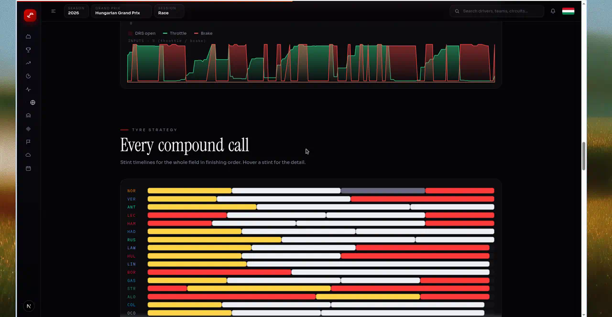
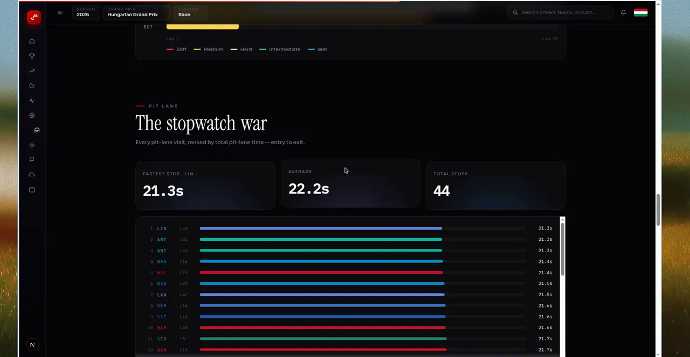
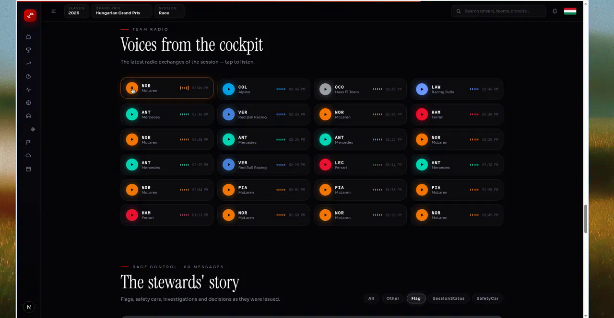
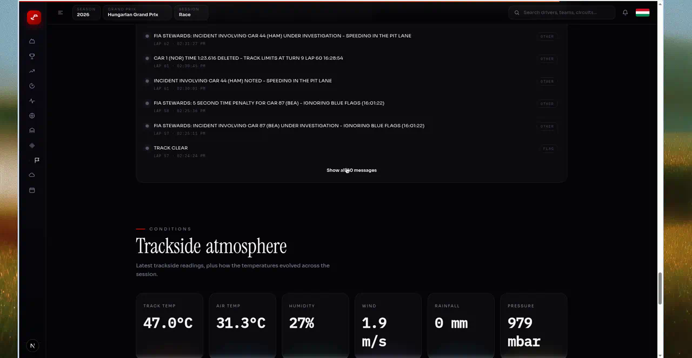
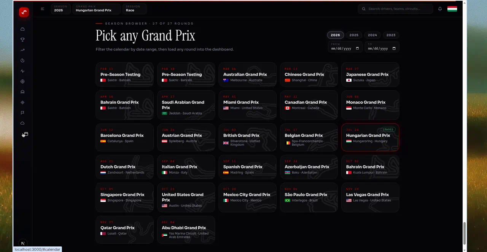
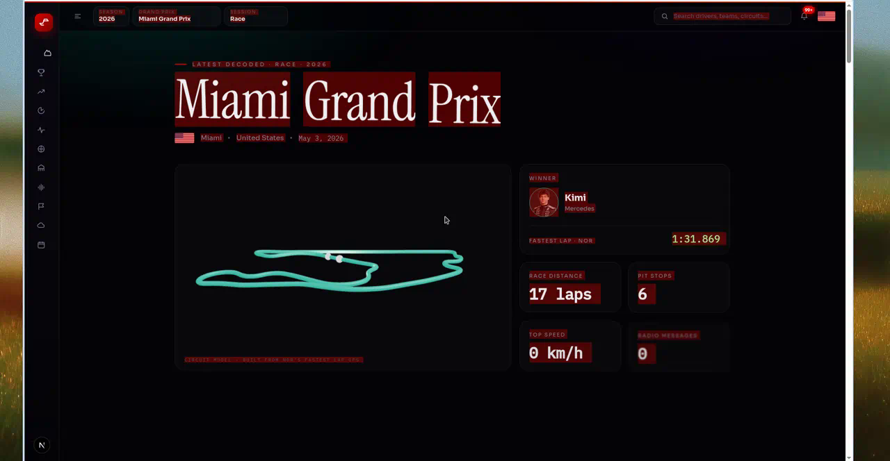

# F1 TrackMate

An interactive Formula 1 race-intelligence dashboard. Pick any Grand Prix from
2023–2026, then scroll a live classification, position battle, telemetry,
tyre strategy, pit stops, team radio, race control and weather — all from the
free [OpenF1](https://openf1.org) timing feed. No API key.

Built with Next.js 16 (App Router), React 19, [Motion](https://motion.dev),
GSAP ScrollTrigger and a Three.js circuit model reconstructed from fastest-lap GPS.

## Demo

<video src="docs/trackmate-dashboard-demo.mp4" controls muted loop width="100%"></video>

[Watch the walkthrough](docs/trackmate-dashboard-demo.mp4) — Hungarian GP overview, charts, team radio, race-control notifications, then a jump to Miami.



## Screenshots

**Classification** — podium with gaps and points, plus the rest of the field.



**Race Control** — bell dropdown with unread flags, investigations and session status.



**Position battle** — every place-change for the top ten; click a driver to isolate them.



**Telemetry + tyre strategy** — fastest-lap throttle/brake inputs and compound timelines for the whole grid.



**Pit lane** — every stop ranked by pit-lane time.



**Team radio** — tap a clip to listen. Race-control feed below with category filters.



**Conditions** — trackside weather plus temperature over the session.



**Season browser** — date-range filter, then load any round into the dashboard.



**Session switching** — Miami Grand Prix, cyan circuit built from Norris’s GPS.



## What it shows

- **Overview** — meeting, 3D circuit ribbon from real GPS, winner, fastest lap, headline stats.
- **Classification** — podium + full running order with gaps and points.
- **Position battle** — place-vs-time step chart; toggle drivers in the legend.
- **Race pace** — clean-air lap times; multi-select any driver into the comparison.
- **Telemetry** — self-drawing speed trace with DRS zones, throttle and brake.
- **Tyre strategy** — stint timeline for every classified driver.
- **Pit stops** — ranked by pit-lane duration, with fastest / average / total.
- **Team radio** — playable clips from the session.
- **Race control** — flags, safety cars and steward notes, filterable by category. Same feed powers the notification bell.
- **Conditions** — track/air temp, humidity, wind, rain, pressure, plus a temperature timeline.
- **Season** — 2023–2026 calendar with live date-range filtering. Click a card to load that GP.

Live sessions auto-refresh every 30 seconds (LIVE badge). Search jumps to a driver in the classification or loads a matching circuit.

## Getting started

```bash
npm ci        # install dependencies
npm run dev   # start the dev server at http://localhost:3000
```

## Scripts

| Command | Description |
| --- | --- |
| `npm run dev` | Start the development server on port 3000. |
| `npm run build` | Production build (type-checks the project). |
| `npm start` | Serve the production build. |
| `npm run lint` | Lint with ESLint (Next core-web-vitals). |
| `npm run check` | Offline self-check for the OpenF1 transforms (no network). |

## Layout

- `app/page.tsx` — mounts the client dashboard.
- `app/api/f1/route.ts` — cached proxy in front of `api.openf1.org`.
- `lib/openf1.ts` — pure transforms (classification, telemetry, pace, stints, pits, radio, race control, track path, weather).
- `lib/openf1.selfcheck.ts` — assertion-based self-check for those transforms.
- `lib/dashboard.tsx` — season / meeting / session selection and the data bundle.
- `components/dashboard/*` — shell (sidebar, topbar, cursor) and every section.
- `docs/` — demo video and screenshots.

## Cloud Agent environment

`.cursor/environment.json` installs dependencies with `npm ci` and runs
`npm run dev` in a persistent terminal on port 3000.
